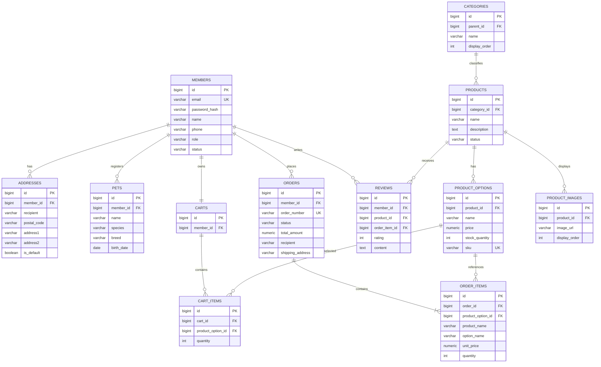

# 포우마루 ERD

## 설계 원칙

- 상품의 판매 단위와 재고는 `product_options`에서 관리한다.
- 주문 시점의 상품명, 옵션명, 가격은 `order_items`에 복사해 이후 변경의 영향을 받지 않게 한다.
- 주문 배송지도 `orders`에 스냅샷으로 저장한다.
- 금액은 부동소수점이 아닌 `numeric(12, 0)`으로 저장한다.
- 데이터는 실제 삭제보다 상태 변경을 우선하여 주문 이력을 보존한다.

## 핵심 관계

1. 회원 한 명은 배송지와 반려동물 정보를 여러 개 가질 수 있다.
2. 카테고리는 부모 카테고리를 참조하여 계층 구조를 만든다.
3. 상품 하나는 여러 옵션과 이미지를 가진다.
4. 장바구니와 주문은 상품이 아니라 재고를 가진 상품 옵션을 참조한다.
5. 리뷰는 구매한 `order_item`을 참조하여 구매자만 작성하도록 검증한다.

